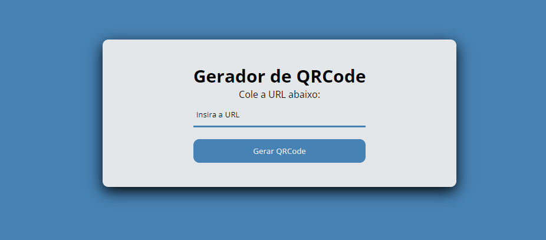

# Gerador de QrCode

The project was developed to make it easier for Internet users to generate a QrCode.


## 📱 Layout


## 💡 How to run this project?

```bash
#Clone this repository
$ git clone https://github.com/Patrick-1810/GeradordeQrCode

#Access the project folder in your terminal
$ cd gerador QrCode

#Install the dependencies
$ npm install

#Run the application
$ npm run dev

#The application will start in your browser

#Note: You must have Git installed on your machine

```

## 👨‍💻 Technologies used
1. [Html](https://developer.mozilla.org/pt-BR/docs/Web/HTML) 
2. [Css](https://developer.mozilla.org/pt-BR/docs/Web/CSS)
3. [JavaScript](https://developer.mozilla.org/pt-BR/docs/Web/JavaScript)
4. [API QrCode](https://goqr.me/api/)

## 😎 Developers
- [Patrick Prestes](www.linkedin.com/in/patrick-azambuja-prestes-839287279)


